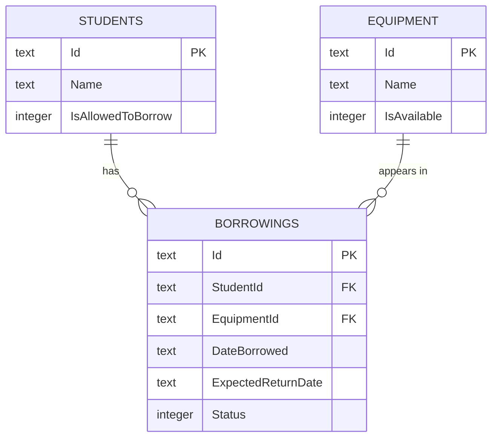

# Equipment Borrowing System — Architecture Overview
# PASQUIL & RAPAL - LAB 3C

----------

## LABORATORY ACTIVITY 1 DOCUMENTATION

### 1. Solution Structure
- **Domain** – Core business concepts (Student, Equipment, Borrowing, BorrowingStatus) and the
  rules that belong to a single concept (e.g. equipment cannot be marked borrowed twice).
- **Application** – Use cases/orchestration (e.g. BorrowEquipmentService) and the repository
  interfaces (contracts) the use cases depend on.
- **Infrastructure** – Concrete, swappable implementations of those contracts. Currently
  in-memory; could become SQLite/PostgreSQL/file-based later without changing Domain or
  Application.
- **Tests** – Automated verification of domain rules and application service behavior.

**Development approach:** this solution was built domain-by-domain — Student was completed
end-to-end (domain class, repository interface, in-memory repository) before Equipment was
started, and Equipment was completed end-to-end before Borrowing. BorrowEquipmentService was
implemented last, as the point where all three domain concepts come together, rather than
building every layer across all concepts before any of them worked.

### 2. Dependency Direction

    ConsoleDemo (composition root / future Avalonia UI)
              |
              v
         Application
           |      ^
           v      |
         Domain   |
                  |
         Infrastructure

Domain depends on nothing. Application depends only on Domain. Infrastructure depends on
Domain and Application (it implements Application's interfaces). The composition root
(ConsoleDemo today, later the UI) is the only place that knows about Infrastructure directly.

### 3. Use Case Mapping

Actor: Student
Use Case: Borrow Equipment
Application Service: BorrowEquipmentService
Domain Objects Used: Student, Equipment, Borrowing, BorrowingStatus
Repository Interfaces Used: IStudentRepository, IEquipmentRepository, IBorrowingRepository
Infrastructure Implementations Used: InMemoryStudentRepository, InMemoryEquipmentRepository,
InMemoryBorrowingRepository

### 4. Reflection

1. **Why depend on a repository interface instead of a database implementation directly?**
   Because the service's job is business logic, not data access technology. Depending on an
   interface means the service can be tested with fakes, and the storage technology can change
   without touching a single line of the service.

2. **Which parts could remain unchanged if SQLite were added later?**
   Domain and Application in their entirety — only Infrastructure would gain a new
   SqliteEquipmentRepository (etc.), and the composition root would swap which concrete class
   it hands to the service constructor.

3. **Which project would eventually contain Avalonia Views?**
   A new UI project (e.g. EquipmentBorrowing.Desktop) that references Application (to call
   services) — it would replace/extend today's ConsoleDemo as the composition root.

4. **Should an Avalonia button directly execute database queries? Why or why not?**
   No. That would collapse all the layering above: the UI would become coupled to a specific
   storage technology and business rules would leak into UI event handlers, making the rules
   untestable and unreusable from any other entry point (e.g. a future API).

5. **What represents the actual business operation requested by the actor?**
   BorrowEquipmentService.ExecuteAsync — everything else (Domain, repositories) exists only to
   support that one orchestrated operation.

----------

## LABORATORY ACTIVITY 2 DOCUMENTATION

EquipmentBorrowing.Desktop is the presentation layer added on top of the Laboratory
Activity 1 architecture. It contains Views (XAML), ViewModels, and the application's
composition root (App.axaml.cs). It references Application and Infrastructure, but
Domain and Application remain fully independent of Avalonia.Neither project
references any Avalonia package.

### Updated Architecture

    Avalonia View
          |
          | Binding / Command
          v
      ViewModel
          |
          | Application Operation
          v
    Application Service
          |
          +---------> Domain
          |
          v
    Repository Interface
          ^
          |
    Infrastructure Implementation

### Borrow Equipment Flow

The user selects a student and equipment on the Equipment view and presses "Borrow
Equipment." This triggers EquipmentViewModel's BorrowCommand, which collects the
selected student, equipment, and return date and calls
BorrowEquipmentService.ExecuteAsync; the same service built in Laboratory Activity 1,
unmodified. The service checks all six borrowing rules against the repositories and
returns a BorrowingResult. The ViewModel reads that result and updates StatusMessage
and reloads the equipment list; it never evaluates the rules itself.

### Return Equipment Flow

The user selects an active borrowing on the Borrowings view and presses "Return
Equipment." BorrowingsViewModel's ReturnCommand calls ReturnEquipmentService.ExecuteAsync
with the selected borrowing's student and equipment ids. The service locates the active
borrowing, marks it returned, marks the equipment available again, and persists both
changes through their repositories. The ViewModel then reloads both the borrowings list
and (indirectly, on next visit) the equipment list to reflect the updated state.

### Architectural Reflection

1. **Why should the View not call a repository directly?**
   The View only knows how to display and collect data — it has no way to judge whether
   an operation is valid. Calling a repository directly would let the interface bypass
   every business rule the Application layer exists to enforce.

2. **Why should business rules not be implemented in the ViewModel?**
   The ViewModel's job is presentation state and coordination, not decision-making.
   Rules living in two places (Application and ViewModel) would drift out of sync, and
   any other future entry point (a web API, a different UI) would have to duplicate them.

3. **What is the responsibility of the ViewModel?**
   Holding presentation state, exposing observable properties and commands, performing
   input-shape validation, and forwarding valid requests to Application services —
   nothing more.

4. **Why can the existing Application layer work without knowing Avalonia is being used?**
   Application depends only on Domain and on its own repository interfaces, both of
   which are UI-agnostic. Avalonia is a detail of how input is collected and results are
   displayed, not a detail the business logic needs to know about.

5. **What advantage comes from registering dependencies in one composition point?**
   Every concrete implementation is chosen in exactly one place. Swapping in-memory
   repositories for something else later means changing App.axaml.cs, not every
   ViewModel that happens to use them.

6. **If SQLite replaced the in-memory repository later, what stays unchanged?**
   Every View, every ViewModel, and every Application service. Only the Infrastructure
   project gains new repository implementations, and the composition root registers
   those instead — the same story as Laboratory Activity 1's reflection answer #2.

   ----------

## LABORATORY ACTIVITY 3 DOCUMENTATION

### Schema
#### STUDENTS
| Column | Type | Constraints |
|--------|------|-------------|
| Id | TEXT (GUID) | PK |
| Name | TEXT | NOT NULL |
| IsAllowedToBorrow | INTEGER (bool) | NOT NULL |

#### EQUIPMENT
| Column | Type | Constraints |
|--------|------|-------------|
| Id | TEXT (GUID) | PK |
| Name | TEXT | NOT NULL |
| IsAvailable | INTEGER (bool) | NOT NULL |

#### BORROWINGS
| Column | Type | Constraints |
|--------|------|-------------|
| Id | TEXT (GUID) | PK |
| StudentId | TEXT (GUID) | FK → STUDENTS.Id, NOT NULL |
| EquipmentId | TEXT (GUID) | FK → EQUIPMENT.Id, NOT NULL |
| DateBorrowed | TEXT (date) | NOT NULL |
| ExpectedReturnDate | TEXT (date) | NOT NULL |
| Status | INTEGER (enum as int) | NOT NULL |

### Normalization Check
Normalization check (1NF -> 2NF -> 3NF)
- **1NF** (atomic values, no repeating groups): every column above holds a
  single atomic value - no comma-separated lists, no repeating equipment/student columns inside
  Borrowings.
- **2NF** (no partial dependency on a composite key): all three tables use a single-column
  primary key (Id), so there's no composite key to have a partial dependency on.
- **3NF** (no transitive dependency): in Borrowings, every non-key column (DateBorrowed,
  ExpectedReturnDate, Status) describes the borrowing itself, not something reachable through
  StudentId or EquipmentId (e.g., you are not storing the student's name or the equipment's name
  inside Borrowings — those live only in STUDENTS/EQUIPMENT and are looked up through the foreign key).

### Constraints and Indexes
- StudentId and EquipmentId on BORROWINGS are foreign keys with NOT NULL. Every borrowing must
  reference a real student and a real equipment item.
- Add an index on BORROWINGS.Status — your app frequently filters WHERE Status = Active (via
  GetAllActiveAsync), so this index speeds up that exact query pattern rather than being a speculative
  "might help someday" index.
- No unique constraints beyond the primary keys are needed — a student can have multiple borrowings 
  (that's the whole point), and nothing else in this schema requires uniqueness.

### Diagram

      

### SQLite and EF Core
SQLite was added via the Microsoft.EntityFrameworkCore.Sqlite NuGet package on
both the Infrastructure and Desktop projects. Entity Framework Core translates
LINQ queries written against DbSet<T> properties into SQL executed against a
local equipmentborrowing.db file.

## DbContext
EquipmentBorrowingDbContext exposes Students, Equipment, and Borrowings as
DbSet<T> properties and applies every IEntityTypeConfiguration<T> in the
Infrastructure project automatically via ApplyConfigurationsFromAssembly. It is
constructed and owned entirely inside Infrastructure/Desktop's composition root
— no View or ViewModel references it directly.

## Repository Transition
Each repository interface (IStudentRepository, IEquipmentRepository,
IBorrowingRepository) gained an EF Core-backed implementation
(EfStudentRepository, EfEquipmentRepository, EfBorrowingRepository) alongside
the existing InMemory* implementations from Labs 1–2. Only the dependency
injection registrations in App.axaml.cs changed to point at the new
implementations — Domain, Application, and every View/ViewModel were
untouched.

## Migration Process
The initial schema was created with:
dotnet ef migrations add InitialCreate --project src/EquipmentBorrowing.Infrastructure --startup-project src/EquipmentBorrowing.Desktop
and applied with:
dotnet ef database update --project src/EquipmentBorrowing.Infrastructure --startup-project src/EquipmentBorrowing.Desktop
The application also calls context.Database.MigrateAsync() at startup so any
future migration is applied automatically without a manual step.

## Generated SQL
1. Query 1
**Line Query:**
_context.Equipment.AsNoTracking().Where(e => e.IsAvailable).ToListAsync();

**Generated sql:**
FROM "Equipment" AS "e"
SELECT "e"."Id", "e"."IsAvailable", "e"."Name"
WHERE "e"."IsAvailable"

**Explanation:**
Filters the Equipment table down to rows where IsAvailable is true,
translating the LINQ .Where() clause directly into a SQL WHERE clause.

2. Query 2
**Line Query:**
from b in _context.Borrowings.AsNoTracking()
join s in _context.Students on b.StudentId equals s.Id
join e in _context.Equipment on b.EquipmentId equals e.Id
where b.Status == BorrowingStatus.Active
select new { s.Name, EquipmentName = e.Name, b.DateBorrowed, b.ExpectedReturnDate }

**Generated sql:**
SELECT "s"."Name", "e"."Name", "b"."DateBorrowed", "b"."ExpectedReturnDate"
FROM "Borrowings" AS "b"
INNER JOIN "Students" AS "s" ON "b"."StudentId" = "s"."Id"
INNER JOIN "Equipment" AS "e" ON "b"."EquipmentId" = "e"."Id"
WHERE "b"."Status" = 0

**Explanation:**
Joins Borrowings to both Students and Equipment to pull in the related
names in one round trip, and filters to only active borrowings (Status = 0,
the integer value EF Core mapped BorrowingStatus.Active to via the
HasConversion<int>() call in BorrowingConfiguration from Part F).

## Persistence Demonstration

Verified by borrowing an item, closing the application completely, reopening
it, and confirming the borrowing and the equipment's unavailable status were
still present — then repeating the same close/reopen check after returning the
equipment.

## Architectural Reflection

1. **Why didn't the application need to be completely rewritten for SQLite?**
   Because Domain and Application never depended on how data was stored —
   only on the repository interfaces. Swapping the implementation behind those
   interfaces is exactly what the abstraction was for.

2. **Why should the ViewModel not use DbContext directly?**
   The ViewModel's job is presentation state and coordination. If it used
   DbContext directly, it would need to know SQL/EF Core concepts, would be
   impossible to test without a real database, and business rules would have
   nowhere principled to live.

3. **What responsibility does the repository implementation now perform?**
   Translating repository interface calls into EF Core LINQ queries and
   SaveChangesAsync calls against the DbContext — the same responsibility the
   InMemory repositories had (fulfilling the interface contract), just backed
   by a real database instead of a List<T>.

4. **What is the purpose of an EF Core migration?**
   A reproducible, versioned record of how the database schema evolves, so the
   schema can be recreated from source control rather than existing only as
   whatever a developer happened to click together in a database tool.

5. **Why are foreign keys important in the borrowing database?**
   They guarantee a Borrowing can never reference a Student or Equipment that
   doesn't exist, enforced by the database itself rather than relying on every
   piece of application code to remember to check.

6. **Why can a read-only query benefit from AsNoTracking()?**
   EF Core skips maintaining change-tracking snapshots for entities that will
   never be modified and saved back, which is faster and uses less memory for
   pure display queries.

7. **What would happen if SQLite were replaced by another provider later?**
   Only the Infrastructure project's UseSqlite call and repository
   implementations would need to change (to, say, UseNpgsql and new
   Ef*Repository classes pointed at it) — Domain, Application, and the entire
   Desktop UI would remain exactly as they are.

-------

# PRE-DEVELOPMENT ANALYSIS

##### A. ACTORS

\-- Students (Primary)

&#x09;- The student expects the system to allow them to view available equipment, submit borrowing requests, track their active borrowings, and successfully return equipment.

\-- Staff / Administrator (Assumption)

&#x09;- To trust that the system enforces borrowing rules automatically (eligibility, availability, limits) without manual double-checking, and to see accurate equipment status.

##### B. USE CASES

###### UC-01: Borrow Equipment

|ITEM|DESCRIPTION|
|-|-|
|Use-Case|Borrow equipment|
|Primary Actor|Student|
|Pre-conditions|Student is registered and currently allowed to borrow; equipment exists|
|Main Action|Student requests to borrow a specific piece of equipment|
|Expected Result|A new `Borrowing` record is created with status `Active`; equipment becomes unavailable|
|Possible Failure|Equipment does not exist, equipment is unavailable, student is not allowed to borrow, or student has reached the maximum active borrowings|

###### UC-02: Return Equipment

|ITEM|DESCRIPTION|
|-|-|
|Use-Case|Return equipment|
|Primary Actor|Student|
|Pre-conditions|An active `Borrowing` exists for this student and equipment|
|Main Action|Student returns previously borrowed equipment|
|Expected Result|Borrowing status changes to `Returned`; equipment becomes available again|
|Possible Failure|No matching active borrowing found; equipment already marked returned|

###### UC-03: Find Available Equipment

|ITEM|DESCRIPTION|
|-|-|
|Use-Case|Find Available Equipment|
|Primary Actor|Student|
|Pre-conditions|None (read-only inquiry)|
|Main Action|Student requests a list of equipment currently available for borrowing|
|Expected Result|System returns the set of equipment whose status is available|
|Possible Failure|No equipment currently available (empty result)|

##### C. DOMAIN CONCEPTS

###### **Student**

1. **Must contain:** an identifier, a name, and something indicating current eligibility to borrow (e.g., `IsAllowedToBorrow` flag, or a status/standing).
2. **Rules/state it owns:** whether it is currently in good standing (this is a fact about the student, so it can live here as a simple flag/property).
3. **Should not be responsible for:** deciding whether a specific borrowing request should be approved (that requires knowledge of equipment availability and current borrowing count, that's a cross-object decision, which belongs in the ***Application Service,*** not inside `Student` itself).

###### **Equipment**

1. **Must contain:** an identifier, a name/description, and its current availability status.
2. **Rules/state it owns:** its own availability (`IsAvailable`), and the behavior to flip that state (`MarkAsBorrowed()` / `MarkAsAvailable()`) since availability is intrinsic to the equipment itself.
3. **Should not be responsible for:** knowing who borrowed it or *when* — that relationship belongs to `Borrowing`, not to `Equipment`.

###### **Borrowing**

1. **Must contain:** a reference to the student, a reference to the equipment, date borrowed, expected return date, and current status (`BorrowingStatus`).
2. **Rules/state it owns:** its own lifecycle — e.g., a `MarkReturned()` method that can only transition `Active → Returned` (not the reverse).
3. **Should not be responsible for:** checking whether the student was allowed to borrow in the first place, or updating the equipment's availability flag on its own initiative without being told to (that orchestration is the ***Application Service***<i>'s</i> job, because it needs to touch *two* objects — Equipment and Borrowing — which a single domain object shouldn't reach out and mutate on its own).
